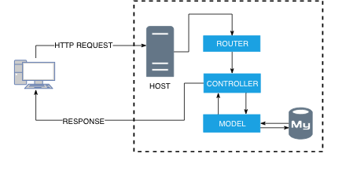
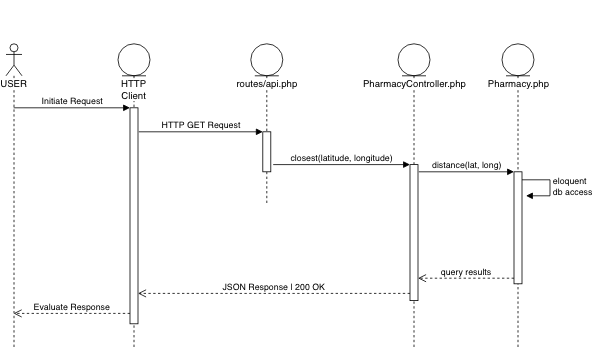

# pharmacy-lookup
This project involved creating an API that is able to retrieve the closest pharmacy from a [csv](database/seeds/pharmacies.csv) file. The API receives latitude/longitude coordinates which describe the location of a user.

In response, the API will return a JSON string with the name, address, and distance between the input latitude/longitude and the location of the pharmacy.

## Technology
To accomplish this task, I decided to add an extra challenge by developing it on Laravel. Since I have no prior experience with PHP or Laravel, I thought this would be the best learning opportunity.

## Architecture
Since this was my first time working with the framework, I decided to keep the architecture simple by using routes, a model, and a controller. Here is a high level overview of how the system functions:

In order to dive a little deeper into the functionality of the code, I have attached a sequence diagram that shows, for this particular use case, the events that external actors generate, their order, and possible inter-system events.

One of the major design decisions I took was to use a third-party dependency to handle all the logic for calculating and finding the shortest distance using latitude/longitude. I made this decision as I am not a fan of re-inventing the wheel and decided to use that time on trying to deploy the app using docker instead.

Although I was unable to deploy the app using docker in time, it gave me a great insight into docker configurations and set-up.

## [Instructions](instructions.md)
Can be found in the [linked](instructions.md) markdown.

## [API Details](RESTAPI.md)
Can be found in the [linked](RESTAPI.md) markdown.

## Wish List
I faced several challenges through the course of this task, as expected with learning any new framework. Below is a list of features that I would have liked to implement, in order of priority:
- REST Validation
  - verify latitude and longitude bounds
  - require latitude/longitude
- Docker-ize app with Laradock
- Continuous Integration: Jenkins, Travis CI, or AWS CodeBuild
- Deploy application using AWS
- POST endpoints to add pharmacies to the database
- Unit Tests
- Automated integration tests to improve continuous delivery and test the integrity of end points  
- Load and Scalability testing using a tool like Gatling.io
